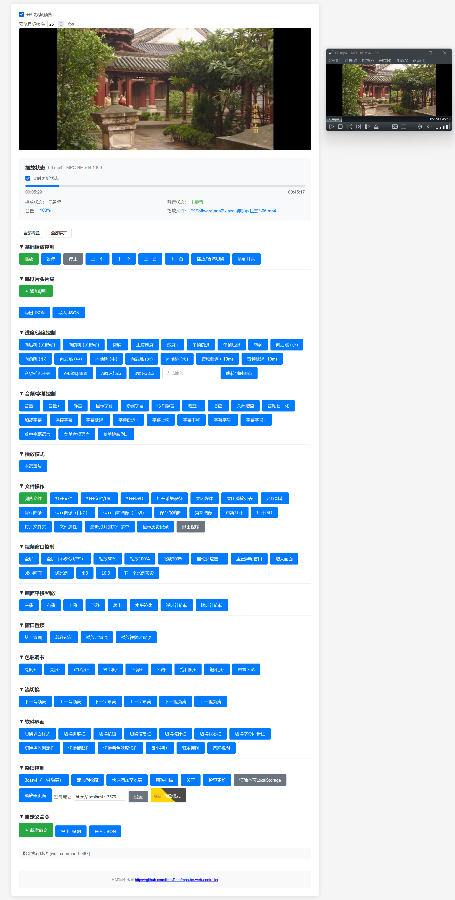

# MPC-BE 网页控制器

一个基于 [MPC-BE](https://github.com/Aleksoid1978/MPC-BE) 播放器开发的网页端控制器，可通过网页界面便捷地操作 MPC-BE 的各项播放控制功能。

**注意！MPC-BE的接口没有任何保护，请谨慎开放使用，以免被他人利用漏洞！**

如果你想找适用于 [MPC-HC](https://github.com/clsid2/mpc-hc) 的网页控制器，请转到 [MPC-HC 网页控制器](https://github.com/little-Data/mpc-hc-web-controller)

 

测试时的版本：1.8.9

# 特色功能

- 视频预览
- 自动更新的播放状态
- 可拖动进度条
- 片头片尾跳过规则
- 全功能控制按钮
- 可更换控制地址
- 页面颜色模式可切换
- 可自行添加自定义命令

# 使用

从 [Releases](https://github.com/little-Data/mpc-be-web-controller/releases) 中下载`mpc-be-web-controller.7z`文件，解压全部文件至一个文件夹中。

打开MPC-BE，点击查看>选项>Web 接口

打开监听端口，启用预览（如果想在页面内显示画面的话），服务页面来自。

复制刚才解压文件到那个文件夹的路径，粘贴到服务页面来自下的输入框中。

点击“应用”，点在网页浏览器中打开即可看到页面。

**注意：即使已经使用web worker来保证页面可以在后台运行（即最小化页面），但各个浏览器的支持却不相同。**

**本页面的调试均在Firefox上进行。如果后台运行不能正常使用（特别是跳过片头片尾功能），尝试一直保持处于该页面，不要最小化，还是不行的话考虑换个浏览器或在其它设备上尝试！**

# 在线使用

**注意：设计之初就是要下载后在本地使用的，能够在线使用风险更高！请自己做好防护！**

**因MPC-BE自己的服务没有CORS（可在控制台看到相关错误），浏览器会出现同源策略禁止的相关错误，请自己找另外的方法解决CORS才能在线使用**

打开[在线地址](https://little-data.github.io/mpc-be-web-controller)，找到“杂项控制”，填写“控制地址”并设置。

页面底部有`[debug]`字样是正常的，该设计在本地使用时如果开启了MPC-BE调试信息就会在此显示。但在线使用时MPC-BE无法替换为调试信息。

**强烈推荐下载后使用，在线使用方法较为复杂**

# 功能详解

所有配置均会保存至LocalStorage中，如想清除所有配置可到“杂项控制”中点击“清除本页LocalStorage”

## 视频预览

该功能会在短时间内大量请求，请合理设置目标帧率。

默认不开启。

原理是请求/snapshot.jpg单帧图片，通过短时间内大量请求实现类似视频播放效果。

通过预览目标帧率可控制请求数量。

## 播放状态

播放状态默认实时更新，可通过进度条调节进度。

## 片头片尾跳过规则

**注意！本功能不是MPC-BE原生支持的，需保持页面打开状态才生效**

点击添加规则，输入片头结束时间，片尾开始时间，从头播放时或播放下一个文件即可生效。

生效后即从片头结束时间开始播放，到片尾开始时间即播放下一个文件。

规则按文件夹分类，设置好文件夹的规则后对同文件夹下所有可播放文件有效。

如果想在所有情况下生效，请将文件夹路径留空。

# License

MIT

尊重成果，请注意表明来源和署名，不允许将署名抹掉后重新发布！

Respect the results, please be careful to indicate the source and attribution, and republishing after erasing the attribution is not allowed! 

# 开发文档

能够实现这么多的功能，离不开下面的文件：

https://github.com/Aleksoid1978/MPC-BE/blob/master/src/apps/mplayerc/resource.h

程序源代码中定义的命令ID，有些是无效的。

只选了`#define ID_`开头的数值当作命令ID

`MPC-BE内置的HTML页面`

所有可用的命令或方法均来自于此：

`/controls.html`中的Goto control提供了时间点跳转方法：`wm_command=-1&position=00:05:48`POST表单到`/command.html`

`/player.html`页面提供`/snapshot.jpg`视频预览帧，同时提供进度条跳转方法：GET方式（好像使用POST表单也行）到`/command.html?wm_command=-1&percent=10.3535353535353`

`/status.html`提供播放状态等信息，UTF-8编码，可以通过下面文件：

https://github.com/Aleksoid1978/MPC-BE/blob/master/src/apps/mplayerc/WebClient.cpp

`bool CWebClientSocket::OnStatus(CStringA& hdr, CStringA& body, CStringA& mime)`部分知道各部分的作用：

`OnStatus('title', 'status', pos, 'posstr', dur, 'durstr', IsMuted(), GetVolume(), 'file')`

`'title'`：`title = m_pMainFrame->GetWindowTextW(title)`，即MPC-BE 播放器的窗口标题。

`'status'`：当前播放器的播放状态。代码中通过`OAFilterState fs`判断状态，此处`fs = State_Stopped`，对应`ResStr(IDS_CONTROLS_STOPPED)`（资源文件中定义的中文 **“已停止”**）

`pos`：当前播放位置的毫秒值。`pos = (int)(m_pMainFrame->GetPos()/10000)`

`'posstr'`：当前播放位置的直观时间显示。posstr是对pos（毫秒）的格式化时间字符串：`posstr.Format(L"%02d:%02d:%02d", (pos/3600000), (pos/60000)%60, (pos/1000)%60);`

`dur`：当前播放文件的总时长毫秒值。`dur = (int)(m_pMainFrame->GetDur()/10000)`

`'durstr'`：当前播放文件的总时长直观时间显示，格式化规则和`posstr`一致。

`IsMuted()`：整数 0 表示未静音，1 表示已静音。`m_pMainFrame->IsMuted()`

`GetVolume()`：播放器的音量值。`m_pMainFrame->GetVolume()`该值为百分比制，0 为静音，100 为最大音量。

`'file'`：播放的文件的实际存储路径。`file = m_pMainFrame->m_wndPlaylistBar.GetCurFileName()`

# 额外文件

因命令过多，页面只放了一些能用且大概率会用到的按钮，其余的做成了自定义命令。

这些文件不包含在Releases的压缩文件中，自行从仓库获取。

不保证能用，点击自定义命令的导入JSON来添加。

`mpc-be-cmds.json`：从内置页面的`/index.html`中提取，去除了已经在页面中的命令。

`mpc-be-cmds-define.json`：从`resource.h`中提取`#define ID_`开头的数值当作命令，去除了已经在页面中，`mpc-be-cmds.json`中的命令。名称是直接翻译的。

`mpc-be-langset.json`：MPC-BE软件界面语言。

以下文件为后续更新使用：

`mpc-be-define-ID_.txt`：当前版本所使用的`#define ID_`开头的数值。

`tools文件夹`：辅助工具，只在开发时使用，平常用不到。
